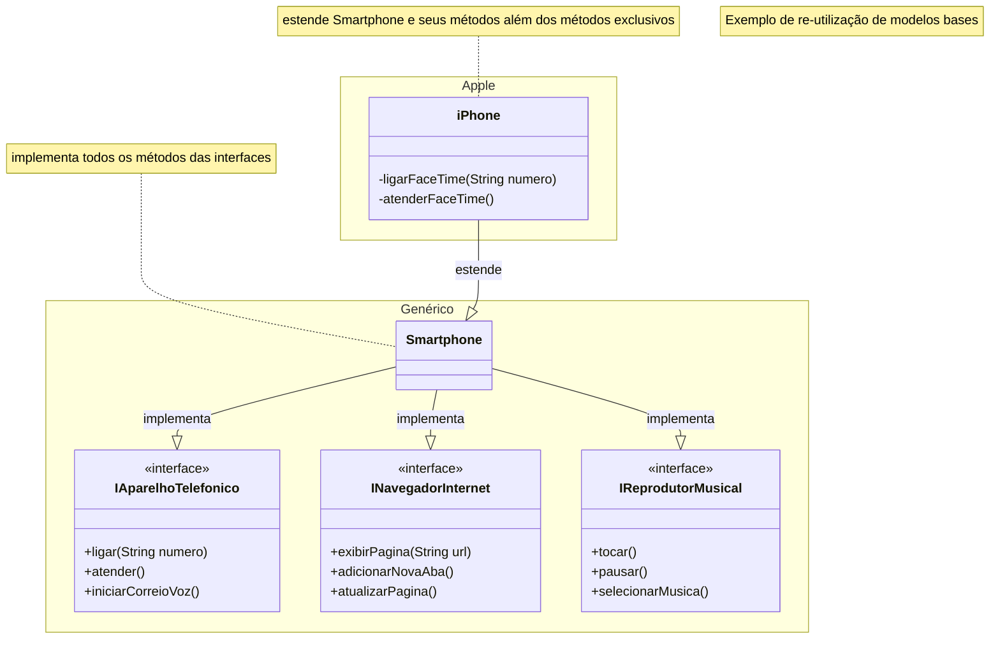

# Modelando o iPhone com UML: Funções de Músicas, Chamadas e Internet

Repositório criado para o **Desafio de Projeto** do Bootcamp Claro - Java com Spring Boot [Digital Innovation One (DIO)](https://www.dio.me/).

[Link do desafio](https://github.com/digitalinnovationone/trilha-java-basico/tree/main/desafios/poo).

### Diagrama UML

